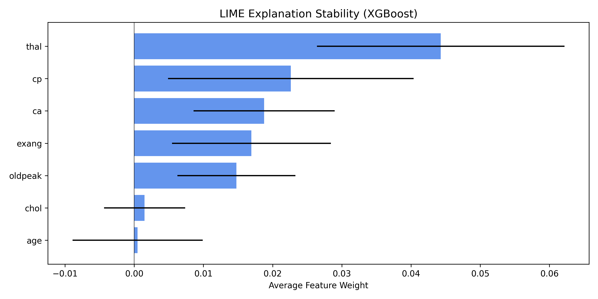
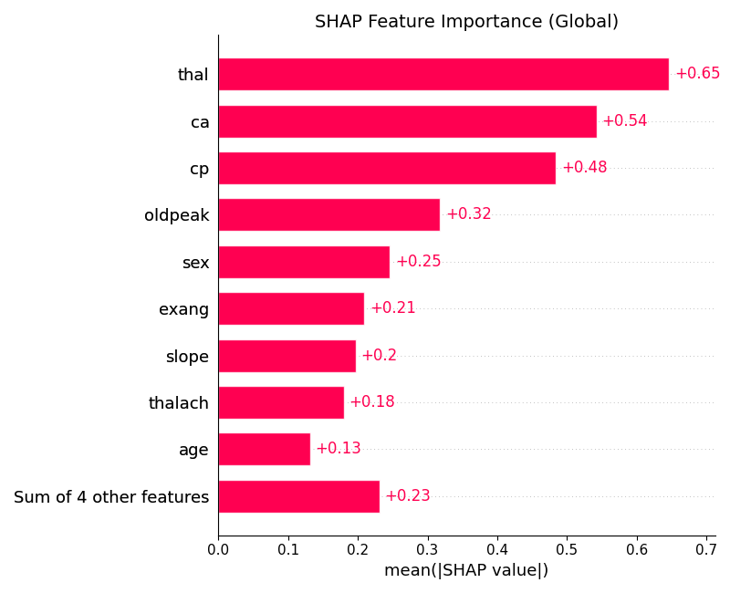

# Heart Disease Prediction and Interpretability

This repository contains the official implementation of the project *Heart Disease Prediction and Interpretability* for the [Applied Machine Learning](https://github.com/mselezniova/AppliedML) course.

We implement and compare classic ML models from scratch, tune them via cross-validation, and interpret predictions using LIME and SHAP.

---

## Requirements

To install all required dependencies:

```
pip install -r requirements.txt
```

---

## Project Structure

```
.
├── assets/                      # Saved SHAP/LIME figures
├── courselib/
│   ├── models/                  # Manually implemented models (logistic, tree, forest)
│   ├── explain/                 # LIME utilities
│   └── utils/                   # Preprocessing, metrics, CV, encoding, etc.
├── Heart_Disease_Interpretability.ipynb  # Main analysis notebook
├── requirements.txt
├── README.md
```

---

## Training

Models are trained inside the notebook using both manual and library-based approaches:

- 🧮 **Logistic Regression** (with GD and momentum)
- 🌳 **Decision Tree** (CART-style)
- 🌲 **Random Forest** (from scratch)
- 🚀 **XGBoost** (via sklearn-compatible API)

Each model is tuned via grid search and 5-fold cross-validation.

---

## Evaluation

Models are evaluated on a held-out test set using:

- **Accuracy**
- Local explanations using **LIME** (sampling-based)
- Global + local explanations using **SHAP** (exact for trees)

---

## Results

| Model                  | Test Accuracy |
|------------------------|---------------|
| Logistic Regression    | 81.7%         |
| Decision Tree (CART)   | 70.0%         |
| Random Forest (manual) | 83.3%         |
| XGBoost                | 83.3%         |

Key features identified by both LIME and SHAP:

- `thal`: Thalassemia
- `cp`: Chest pain type
- `ca`: Number of major vessels

Example: Confusion matrix for Random Forest (manual):

<p align="center">
  
</p>


---

## Interpretability Examples

<p float="left">
  
  
</p>

---

## Final Report

The corresponding report is not included in this repository.  
Please contact me directly to request a copy.
